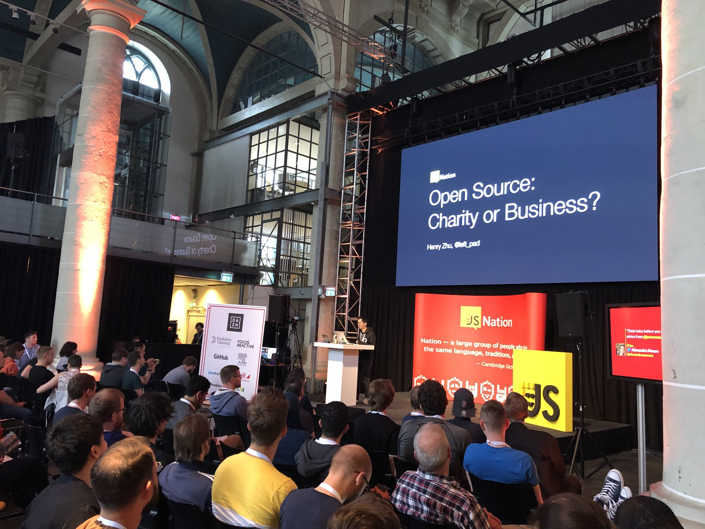

# Open Source: Charity or Business ([JSNation](https://jsnation.com/))

[HTML](https://hzoo.github.io/open-source-charity-or-business/) | [PDF](https://github.com/hzoo/open-source-charity-or-business/blob/master/Charity%20or%20Business.pdf) | [Links](#links) | Video (TBD)

## Links

- ["The culture war at the heart of open source"](https://words.steveklabnik.com/the-culture-war-at-the-heart-of-open-source) (Steve Klabnik)
- [1 Corinthians 9:19-23](https://www.biblegateway.com/passage/?search=1+Corinthians+9%3A19-23&version=ESV)
- [Hope in Source, podcast](https://hopeinsource.com)
- [Maintainers Anonymous, (podcast)](http://maintainersanonymous.com)
